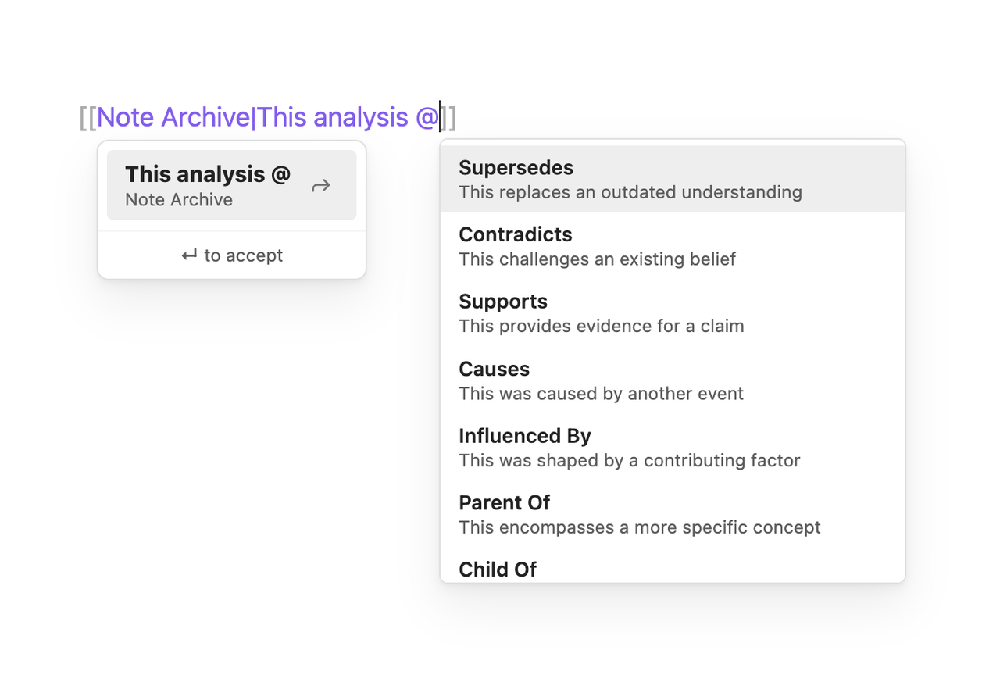

# Wikilink Types

An [Obsidian](https://obsidian.md) plugin that adds typed relationships to wikilinks. Type `@` inside a wikilink alias to trigger an autocomplete dropdown of relationship types. On selection, the plugin syncs the relationship to YAML frontmatter automatically — so Dataview, Graph Link Types, Breadcrumbs, and the rest of the ecosystem can consume it without changes.



## How It Works

Type `@` inside a wikilink alias to trigger the autocomplete — either after a space or right after the `|`. You can use one or multiple relationship types in natural display text:

```
[[Analysis|The new research @supersedes and @contradicts the previous analysis]]
```

On save, each `@type` that matches a configured relationship type is synced to YAML frontmatter:

```yaml
---
supersedes:
  - "[[Analysis]]"
contradicts:
  - "[[Analysis]]"
---
```

You never touch YAML. The `@` syntax is the authoring interface. The YAML is the storage and compatibility layer. The frontmatter is the authoritative source for all programmatic and AI uses.

### Rules

- `@type` must be preceded by a **space** or appear at the **start of the alias** (right after `|`) — `john@causes.com` is ignored, `text @causes` and `[[Note|@causes]]` both match
- Only configured relationship types generate frontmatter — `@monkeyballs` in display text is just text
- Multiple `@types` per wikilink are supported — each creates its own frontmatter entry
- `@` in display text that doesn't match a configured type is left alone for human readability

### Authoring Flow

1. Type `[[Note Name|Your display text @` — the autocomplete dropdown appears
2. Select a relationship type (or keep typing to filter)
3. Continue writing display text, or add another `@type`
4. Close the link with `]]`
5. On save, the plugin syncs matched types to YAML frontmatter

## Installation

### Community Plugins (coming soon)

1. Open **Settings → Community Plugins → Browse**
2. Search for **Wikilink Types**
3. Click **Install**, then **Enable**

### BRAT (pre-listing)

If the plugin isn't in the Community Plugins directory yet, install via [BRAT](https://github.com/TfTHacker/obsidian42-brat):

1. Install BRAT from Community Plugins
2. Open Command Palette → **BRAT: Add a beta plugin for testing**
3. Paste: `penfieldlabs/obsidian-wikilink-types`
4. Click **Add Plugin**, then enable in **Settings → Community Plugins**

### Manual

1. Download `plugin.zip` from the [latest release](https://github.com/penfieldlabs/obsidian-wikilink-types/releases)
2. Unzip and copy the `wikilink-types` folder into your vault's `.obsidian/plugins/` directory
3. Enable the plugin in **Settings → Community Plugins**

> **Tip:** Use **Settings → Community Plugins → 📁** (Open plugins folder) to open the plugins directory, then drag the `wikilink-types` folder in.

## Configuration

Relationship types are stored in `data.json` inside the plugin directory (`.obsidian/plugins/wikilink-types/data.json`). On first run, the plugin writes a default set of 24 types. Edit the JSON directly to add, remove, rename, or reorder types.

Each entry has three fields:

```json
{
  "key": "supersedes",
  "label": "Supersedes",
  "description": "This replaces an outdated understanding"
}
```

- **key** — written to the wikilink and used as the YAML frontmatter field name
- **label** — displayed in the autocomplete dropdown
- **description** — shown below the label in the dropdown

## Compatibility

| Plugin | Works? | How |
|---|---|---|
| Dataview | Yes | Reads YAML frontmatter natively |
| Graph Link Types | Yes | Reads frontmatter via Dataview |
| Breadcrumbs | Yes | Reads frontmatter |
| Juggl | Yes | Reads Dataview metadata |
| Templater | Yes | No conflicts |
| Excalidraw | Yes | No conflicts |

## Graceful Degradation

If you uninstall the plugin:

- YAML frontmatter remains — **no data loss**
- `@type` text stays visible in wikilink aliases — readable, just not styled
- All Dataview queries continue to work
- Graph Link Types continues to work

## License

[AGPL-3.0](LICENSE)
